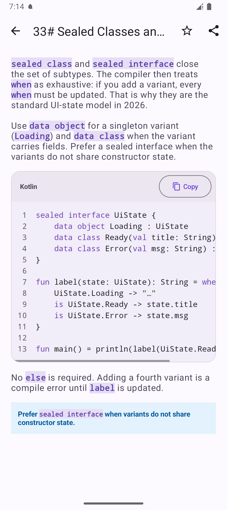
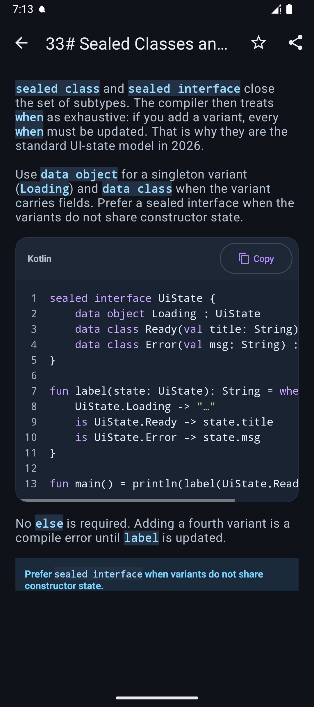

# CodeBlockView

An Android View for displaying read-only code snippets. Extracted from
[Kotlin](https://github.com/halilozel1903/Kotlin).

- Kotlin syntax highlighting, line numbers and horizontal scrolling
- Selectable source and a copy button that preserves the original whitespace
- Light/dark palettes and English/Turkish copy labels
- XML and Kotlin usage; no network access or permissions

## Screenshots

Real screenshots from the Kotlin app's **Sealed Classes and when** lesson,
running the published `1.0.0` dependency on a Pixel 9a emulator.

| Light theme | Dark theme |
| --- | --- |
|  |  |

The surrounding lesson text and toolbar belong to the host app. The library
renders the card with syntax highlighting, line numbers, horizontal scrolling
and the copy button.

## Install

Requires Android API 24+, a Material Components/Material 3 theme, and a consumer
build compatible with the AndroidX/Material dependencies (compile SDK 37 for the
versions used in this release). The library is built with Java 17 and AGP 9.4.0.

Add the repository in `settings.gradle.kts`:

```kotlin
dependencyResolutionManagement {
    repositories {
        google()
        mavenCentral()
        maven("https://jitpack.io") {
            content { includeGroup("com.github.halilozel1903") }
        }
    }
}
```

Add the versioned dependency in your module:

```kotlin
implementation("com.github.halilozel1903:CodeBlockView:1.0.0")
```

## Usage

```xml
<com.halilozel.codeblockview.CodeBlockView
    android:id="@+id/codeBlock"
    android:layout_width="match_parent"
    android:layout_height="wrap_content" />
```

```kotlin
import com.halilozel.codeblockview.CodeBlockView

val codeBlock = findViewById<CodeBlockView>(R.id.codeBlock)
codeBlock.setCode("val greeting = \"Hello Kotlin\"\nprintln(greeting)")
// Other language labels are displayed as plain text, without Kotlin highlighting.
codeBlock.setCode("SELECT * FROM users", language = "sql")
```

`setCode(source, language)` replaces the snippet and resets the copy button.
The default language is `kotlin`; `kt` and `kts` also enable highlighting.
An empty language shows a localized “Code” label. Empty source disables copying.
The tokenizer is a lightweight display helper, not a compiler or full parser.
This is an Android View, not a Compose component or code editor.

## Appearance and localization

The host activity must use a theme derived from `Theme.MaterialComponents` or
`Theme.Material3`. Colors adapt to Android's night mode. Override the `cbv_`
resources in your app's `values` / `values-night` directories to customize the
palette (for example `cbv_code_keyword` or `cbv_code_block_background`).
Copy button labels use `cbv_code_copy`, `cbv_code_copied`, `cbv_code_clip_label`
and `cbv_code_plain`; provide localized overrides for additional languages.

## Build and contribute

Install JDK 17 and Android SDK 37, then run:

```sh
./gradlew testDebugUnitTest lintRelease publishToMavenLocal
```

Pull requests and issues are welcome. Keep source-copy behavior and token ranges
covered by tests. CI checks tests, lint and the Maven publication. Releases use
immutable version tags consumed through [JitPack](https://docs.jitpack.io/android/).

## License

[MIT](LICENSE).
